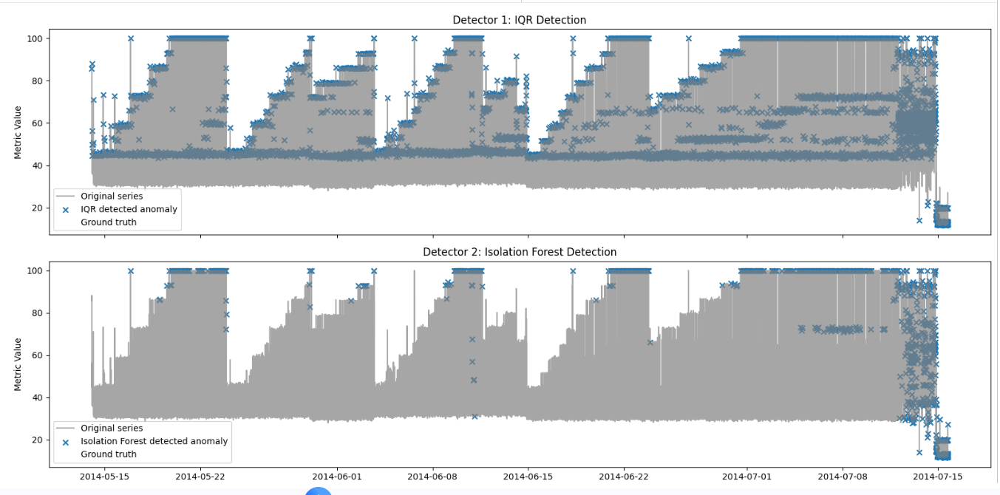
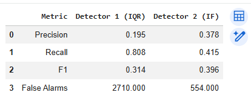
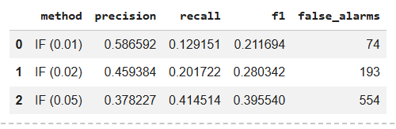

# SUBMIT - Anomaly Detection

## Screenshots:

### Plot kết quả anomaly detection cho 2 detector



### Bảng so sánh Precision / Recall
- So sánh best detector trên 2 bảng



Ghi chú: IQR chọn ngưỡng tốt nhất theo F1 là `IQR (2.0)`; Isolation Forest chọn contamination tốt nhất theo F1 là `0.05`.

## Log:

### Output khi tune contamination 3 lần:




## Model artifacts:

Model Isolation Forest đã train được lưu tại:

```text
isolation_forest_model.pkl
```

Kích thước artifact: `2170.94 KB`.

### Reflection
- Data thuộc loại:

    Non-stationary: mean thay đổi theo thời gian, ACF giảm rất chậm.

    Không seasonal rõ ràng: ACF không có peak lặp lại tại một period cố định.

    Right-skewed mạnh: skewness = 2.42 > 1, histogram lệch phải, không Gaussian.

- Chọn method nào?

    Detector 1: IQR

    Chọn IQR vì:

    Data skewed mạnh.

    Không phù hợp dùng Rolling Z-score/3σ vì 3σ giả định data gần Gaussian.

    Không chọn STL vì ACF không cho thấy seasonal pattern rõ ràng.

    IQR dùng percentile nên robust hơn với dữ liệu lệch và outlier.

    Detector 2: Isolation Forest

    Chọn Isolation Forest vì:

    Không giả định phân phối Gaussian.

    Phù hợp với dữ liệu skewed.

    Có thể dùng nhiều feature thời gian như rolling mean, rolling std, rate of change lag features.

- Detector nào tốt hơn?

    Nếu xét Recall, IQR tốt hơn vì bắt được nhiều anomaly thật hơn.

    Nếu xét Precision, F1 và False Alarms, Isolation Forest tốt hơn.

- Trade-off

    IQR: Recall cao: bắt được nhiều anomaly thật, Nhưng false alarm rất nhiều. Phù hợp khi ưu tiên “không bỏ sót anomaly”.

    Isolation Forest: Precision cao hơn, False alarm ít hơn nhiều, Nhưng recall thấp hơn, tức là bỏ sót nhiều anomaly hơn.

- Production choice: IQR làm first-pass detector, Isolation Forest làm second-pass filter.

    Vì: 
    IQR bắt rộng để giảm nguy cơ miss anomaly.

    Isolation Forest lọc bớt false alarm để tránh alert fatigue.

    Nếu bắt buộc chọn một detector duy nhất, chọn Isolation Forest vì F1 cao hơn và false alarm thấp hơn nhiều, phù hợp hơn cho hệ thống production cần cảnh báo chất lượng.