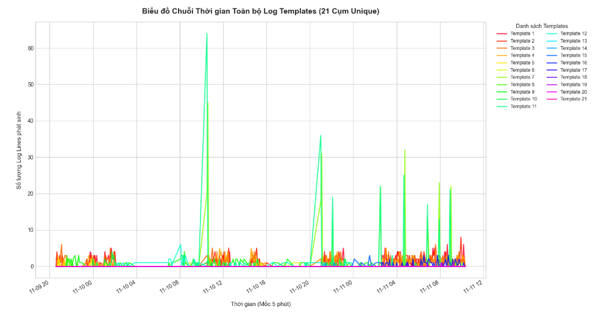
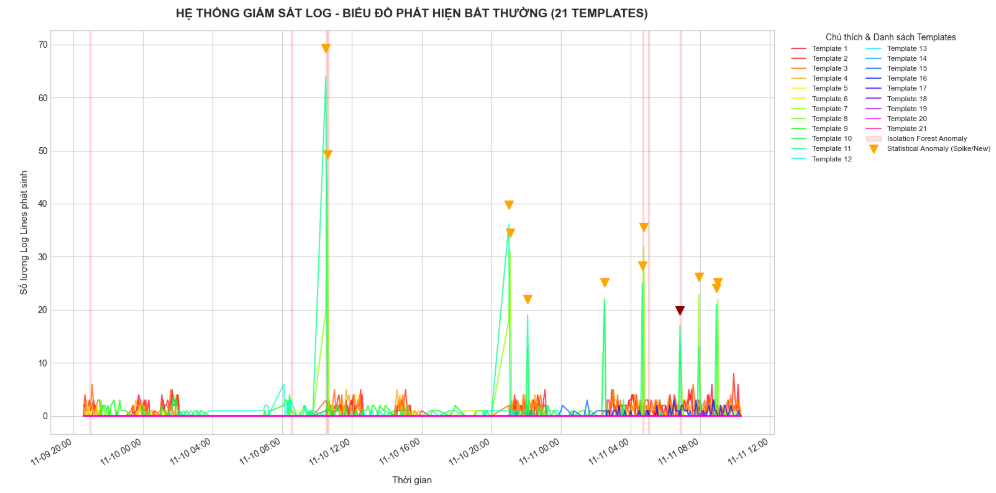
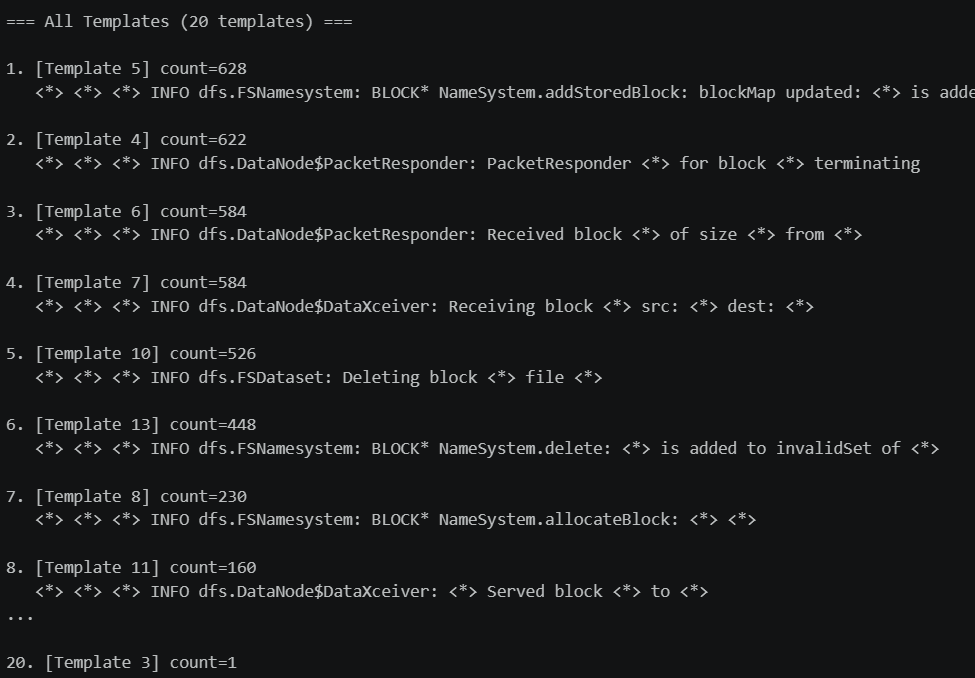
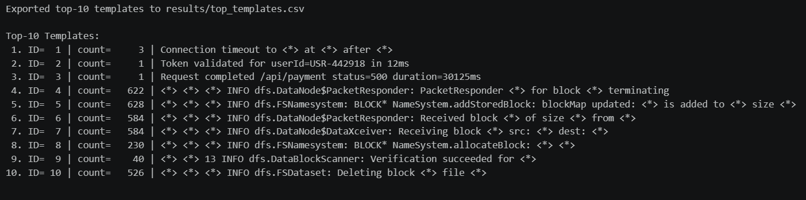
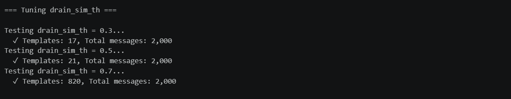

# SUBMIT

## Screenshots

### Template Count Time Series

- Plot template count time series:

### Anomaly Highlighted

- Plot anomaly highlighted:

## Log

### Drain3 Output

- Số template sau khi parse bằng Drain3: 20 templates

- Top-10 templates:

### Tuning Log

## Reflection

### Drain3 Parse Tốt Không?

Drain3 parse khá tốt khi gom được nhiều log line có cùng cấu trúc thành một template chung, đặc biệt với các message lặp lại nhiều lần như block received, block deleted, packet responder terminating, hoặc addStoredBlock. Việc thay các giá trị động bằng wildcard `<*>` giúp giảm nhiễu từ block ID, size, host, port và timestamp.

Tuy nhiên chất lượng parse phụ thuộc nhiều vào `sim_th`. Nếu threshold quá thấp, các message khác ý nghĩa có thể bị gộp chung. Nếu threshold quá cao, cùng một loại event có thể bị tách thành quá nhiều template nhỏ, làm time series bị rời rạc và khó phân tích.

### Template Nào Cho Insight?

Các template có insight tốt thường là template liên quan trực tiếp đến hành vi hệ thống, ví dụ:

- `dfs.FSNamesystem: BLOCK* NameSystem.addStoredBlock`: cho thấy block được ghi nhận vào block map.
- `dfs.DataNode$PacketResponder`: phản ánh quá trình phản hồi packet khi ghi block.
- `dfs.DataNode$DataXceiver: Receiving block`: cho thấy hoạt động nhận block giữa các node.
- `dfs.FSDataset: Deleting block`: có thể liên quan đến cleanup hoặc replication balancing.
- `WARN dfs.DataNode$DataXceiver: exception while serving`: template cảnh báo này đáng chú ý vì có thể liên quan lỗi phục vụ block.

Template có level `WARN` hoặc template xuất hiện đột ngột/spike mạnh thường cho insight tốt hơn template INFO phổ biến, vì chúng có khả năng gắn với lỗi, thay đổi workload, hoặc thay đổi trạng thái hệ thống.

### Metric vs Log Khác Gì?

Metric cho biết hệ thống đang thay đổi về mặt định lượng, ví dụ CPU, memory, latency, throughput hoặc số lượng event theo thời gian. Metric phù hợp để phát hiện spike, drop, trend và anomaly ở mức tổng quan.

Log cho biết ngữ cảnh và nguyên nhân tiềm năng phía sau thay đổi đó. Sau khi parse thành template, log giúp trả lời câu hỏi event nào đang xảy ra, event nào mới xuất hiện, event nào tăng bất thường, và message nào liên quan trực tiếp đến lỗi.

Nói ngắn gọn, metric tốt để phát hiện "có bất thường", còn log template tốt để giải thích "bất thường đó có thể đến từ đâu".
