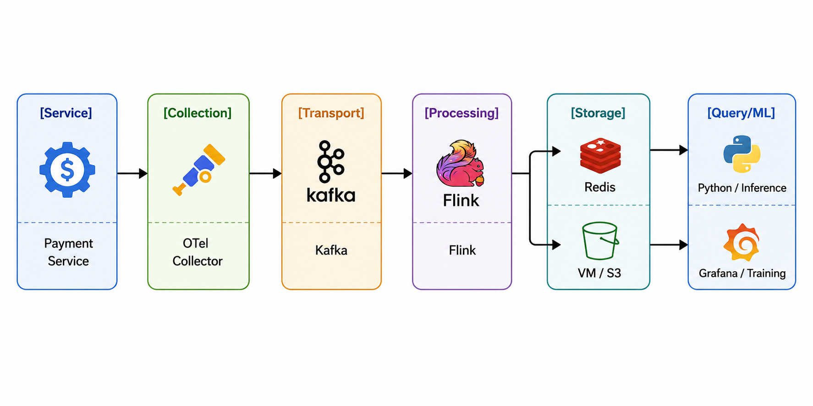

# AIOps Platform - Observability Architecture Submission

## 1. Architecture Diagram

Use case: Anomaly detection in payment service




---

## 2. Cost Estimate

### Monthly Observability Cost Comparison (USD)

| Tier   | Services | Log GB/day | Metric events/sec | Build Storage | Build Compute | Build Network | Build Total | Datadog Storage | Datadog Compute | Datadog Network | Datadog Total | Buy/Build |
|--------|----------|------------|--------------------|---------------|---------------|---------------|-------------|-----------------|-----------------|-----------------|---------------|-----------|
| Small  | 10       | 50         | 100,000            | $45           | $94           | $112          | $252        | $510            | $200            | $150            | $860          | 3.4x      |
| Medium | 100      | 500        | 1,000,000          | $448          | $945          | $1,125        | $2,518      | $5,100          | $2,000          | $1,500          | $8,600        | 3.4x      |
| Large  | 1000     | 5,120      | 10,000,000         | $4,593        | $9,467        | $11,520       | $25,579     | $52,224         | $20,000         | $15,360         | $87,584       | 3.4x      |

**Key Insights:**
- Self-hosted (Build) solutions are consistently **3.4x cheaper** than Datadog across all tiers
- At medium scale (100 services), monthly savings = **$6,082** ($73k annually)
- At large scale (1000 services), monthly savings = **$62,005** ($744k annually)

**Assumptions:**
- Month length: 30 days
- Build storage: 30-day retention, 0.5x compression, 2x replication, 0.3 index overhead
- Build compute: 250 log GB/vCPU/day, 50,000 metric events/vCPU/sec, 0.05 service overhead vCPU/service
- Datadog SaaS: $0.1/GB log ingest, $1.7/GB indexed logs, 0.2 indexed ratio, $15/host-month

---

## 3. ADR Decision Summary

### ADR-001: Selection of Monitoring Infrastructure

**Decision:** Adopt **Prometheus** (Kubernetes-native via Helm) + Grafana visualization

**Rationale:**
- **Cost Efficiency:** ~$1,200/month vs. Datadog's ~$15,000/month (90%+ savings)
- **Data Sovereignty:** Metrics remain within VPC; complies with strict data security requirements
- **Latency:** Local Prometheus scraping <100ms vs. Datadog's 2-5 second ingestion delay
- **Operational Trade-off:** Accept manual maintenance of retention policies and storage scaling (Thanos/Cortex) for long-term data

**Impact for Series A Growth:**
- Enables cost-predictable scaling as service count grows
- Supports SLO-driven monitoring and alerting for high-reliability requirements
- Minimal variable costs allow reinvestment into product development

---

## 4. Platform Engineer Reflection: Build vs. Buy

### Scenario
As a Platform Engineer hired for a 50-service Series A startup that recently raised funding, should we build or buy observability infrastructure?

### Recommendation: **HYBRID APPROACH**

**Reasoning:**

#### Why Build (Primary Strategy)
1. **Economics:** At 50 services, self-hosted Prometheus costs ~$1,200/month vs. ~$8,600/month for Datadog—a **7x cost difference**. Series A budgets demand capital efficiency.
2. **Optionality:** Building proprietary observability infrastructure creates competitive advantage (startup can monetize insights, reduce customer acquisition costs).
3. **Team Maturity:** With Series A funding, we can afford 1-2 platform engineers to maintain the monitoring stack. The infrastructure ROI justifies the headcount.
4. **Scalability Path:** Prometheus + Grafana + Alertmanager scales to 500+ services with proven operational playbooks.

#### When to Buy (Specific Cases)
- **If product is data-driven ML/analytics:** Native integrations with ML tools (Datadog has better APM for distributed tracing) may justify cost.
- **If team lacks DevOps expertise:** Consider managed Prometheus alternatives (Grafana Cloud, New Relic) as middle ground.
- **If customer compliance mandates:** (FedRAMP, SOC2) SaaS solutions with certifications reduce audit burden.

#### Hybrid Implementation Strategy
```
Months 1-6:  Deploy self-hosted Prometheus (Build foundation)
Months 6-12: Supplement with Datadog APM/Tracing only (Buy what you can't build)
12+ months:  Transition custom tools to open-source equivalents
```

**Bottom Line:** At Series A with 50 services and fresh capital, **build the foundation but maintain flexibility.** Reinvest Datadog savings into product; add SaaS tools for specialized observability domains (tracing, synthetic monitoring) as the organization scales.
