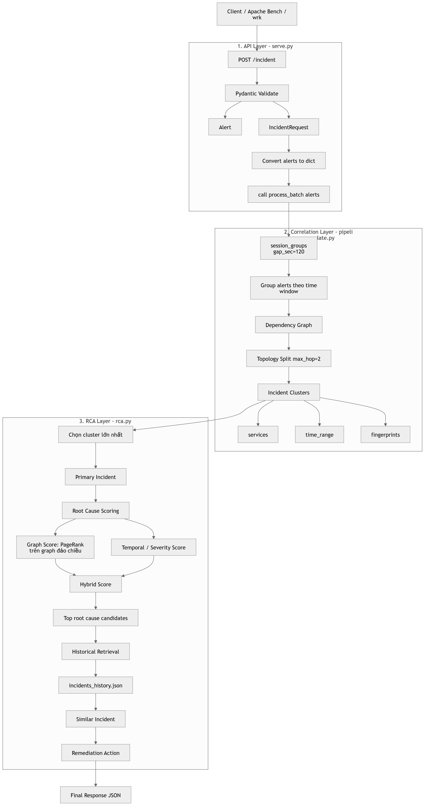
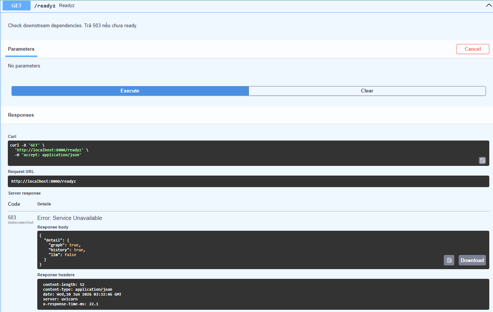

# DESIGN

## Câu 1

Endpoint `/incident` trong `serve.py` dùng kiến trúc pipeline đồng bộ, chia thành ba lớp rõ ràng. Bước đầu là API layer của FastAPI: request được validate bằng Pydantic (`Alert`, `IncidentRequest`), sau đó convert sang `dict` và gọi `process_batch`. Bước hai là correlation layer trong `pipeline.py` + `correlate.py`: hệ thống group alert theo thời gian bằng `session_groups(gap_sec=120)`, rồi tách tiếp theo topology bằng dependency graph (`max_hop=2`). Kết quả là các cluster incident có `services`, `time_range`, `fingerprints`. Bước ba là RCA layer trong `rca.py`: chọn cluster lớn nhất làm primary incident, chấm điểm root cause bằng hybrid score giữa graph score (PageRank trên graph đảo chiều) và temporal/severity score, rồi enrich bằng historical retrieval từ `incidents_history.json` để suy ra incident tương tự và remediation action.

## Câu 2

Latency budget hợp lý cho endpoint này có thể chia như sau: 5–10ms cho FastAPI request parsing + schema validation, 10–30ms cho correlation vì dữ liệu alert batch nhỏ và graph đã load sẵn ở module level (Đã test trên api `/incident`), trả về kết quả latency endpoint = 33 ms `2026-06-10 10:10:10,711 INFO POST /incident 200 27ms`. Tổng ngân sách thực tế nên giữ dưới khoảng 40ms cho batch nhỏ. Middleware `X-Response-Time-Ms` trong `serve.py` cũng hỗ trợ đo end-to-end latency trực tiếp.

## Câu 3

Một production concern quan trọng là fault tolerance. Phần `/readyz` cho thấy hệ thống phụ thuộc vào graph, history, và có kiểm tra LLM tùy chọn (Theo hình thì graph, history đã sẳn sàng, còn LLM chưa được cấu hình trong pipline nên sinh ra lỗi). 
Để handle tốt hơn trong production, pipeline nên degrade gracefully: nếu PageRank lỗi thì fallback sang `in_degree_centrality` (đã có trong `rca.py`), nếu historical retrieval lỗi thì vẫn trả root cause cơ bản và default actions, còn readiness không nên hard-block vì external LLM. Cách này giúp endpoint vẫn phục vụ được dù một thành phần enrich bị lỗi.

## Câu 4

Trade-off chọn FastAPI thay vì Flask/BentoML là hợp lý cho bài này. So với Flask, FastAPI có request validation, response model, async middleware, OpenAPI docs và typed API tốt hơn nên giảm boilerplate cho service inference/API pipeline. So với BentoML, bài toán ở đây chưa cần model serving lifecycle phức tạp, runner abstraction hay artifact packaging; pipeline chủ yếu là orchestration logic + graph/RAG nhẹ. Vì vậy FastAPI đơn giản hơn, triển khai nhanh hơn và đủ mạnh cho incident endpoint hiện tại.